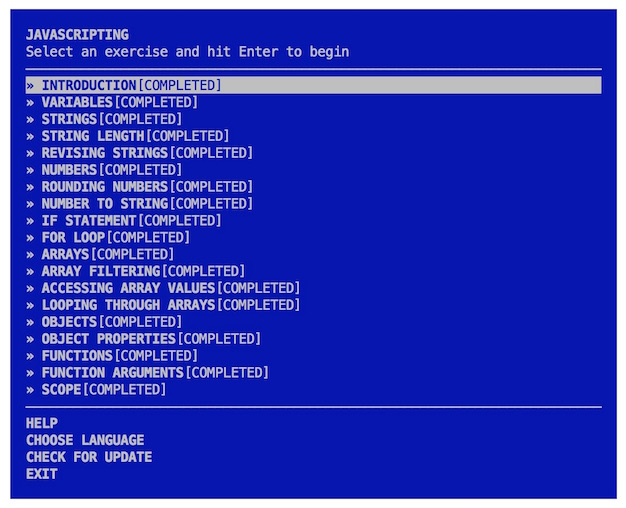
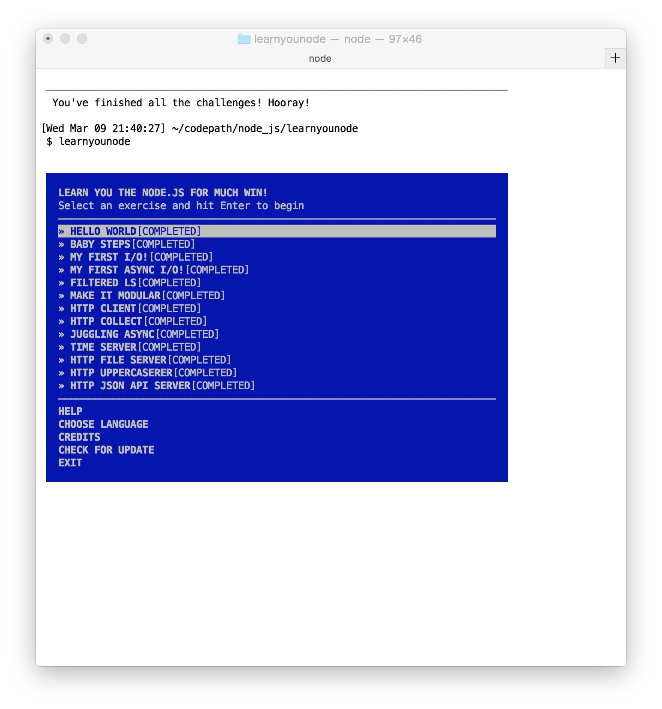

### Time spent: `24 hours`

## Pre-work

## Echo and Proxy Server

### Features

* [x] Can you successfully echo requests made to the echo server?
* [x] Can you successfully proxy requests made to the proxy server?
* [x] Did you include a CLI as described above?
* [x] Does your app log request to stdout or save it properly to a file when the log argument is given?
* [x] Did you successfully push your code to github? Can you see the code on github?
* [x] Did you add a README which includes a GIF walkthrough of the app's functionality?
* [x] Did you create an issue on the repo and include /cc @codepathreview @codepath in the issue body?

### Walkthrough

## Pre-work

## Echo and Proxy Server

### Features

* [x] Can you successfully echo requests made to the echo server?
* [x] Can you successfully proxy requests made to the proxy server?
* [x] Did you include a CLI as described above?
* [x] Does your app log request to stdout or save it properly to a file when the log argument is given?
* [x] Did you successfully push your code to github? Can you see the code on github?
* [x] Did you add a README which includes a GIF walkthrough of the app's functionality?
* [x] Did you create an issue on the repo and include /cc @codepathreview @codepath in the issue body?

### Walkthrough

